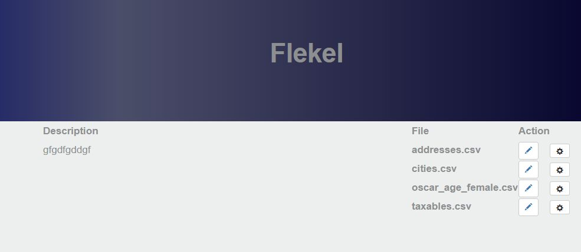
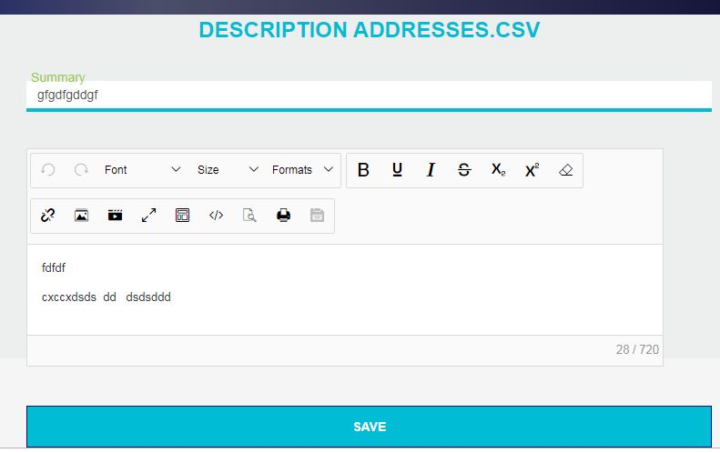

# flekcel
flask editing csv file with handsontable

## I have add a new utility : 
python csvtodatatablehtml.py [file csv]  > file_html_datatable.html 

This will make a html page for display csv in datatable https://datatables.net/ 

 
